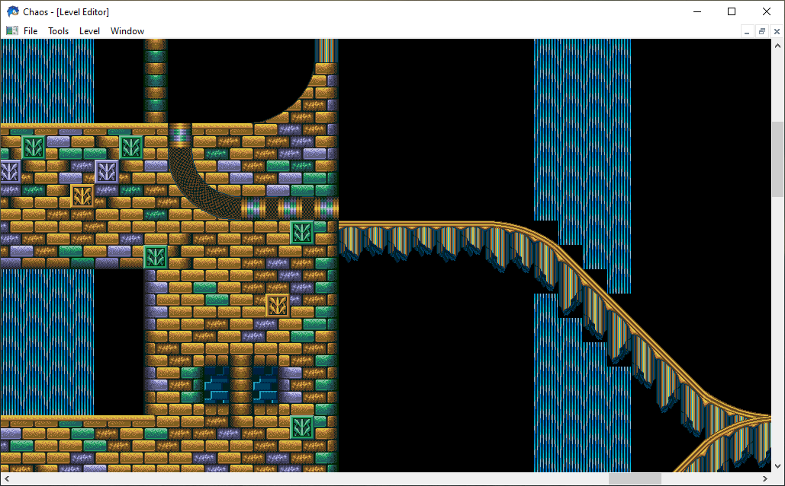

# Chaos

A level editor for Sonic The Hedgehog Mega Drive / Genesis ROMs.

This is a C++ port of Brett Kosinski's [Chaos level editor](https://github.com/fancypantalons/chaos). It can be used to modify Sonic The Hedgehog 2 ROM files. It can also be used to view levels from Sonic The Hedgehog 3 ROMs.

Exploring _Hydrocity Zone_ from [Sonic The Hedgehog 3](https://en.wikipedia.org/wiki/Sonic_the_Hedgehog_3):

Although it was tempting to change the name, I've continued to use the name _Chaos_, since this port attempts to preserve the simplicity and openness of the original code.

## Background

I first discovered Brett Kosinski's Chaos level editor around 2001. Remarkably, this open source level editor made it possible to edit levels directly within a ROM file for Sonic The Hedgehog 2. Not only did Brett manage to extract the compressed level and art data from the ROM, his program also allowed new data to be saved to the ROM file, relocating level data to the end of the file and updating the necessary metadata.

Included in the [doc](./doc) directory is Brett Kosinski's [write up](./doc/kosinski.txt) of the compression algorithm used.

As a pretty average high-schooler circa 2001, I found this sophistication mind-blowing. I spent many days (probably weeks) figuring out how it all worked, and while I didn't quite grasp it all at the time, I eventually produced my own rudimentary level editor using Visual Basic. My editor worked with save states, and a few people in the SEGA reverse engineering community seemed to appreciate it.

In the years that followed, I came back to this challenge as a way to learn new languages and to refine my skills as a programmer. First with Delphi/Pascal, and then with C++. Many years later, I even had a go [with Haskell](./haskell).

## Current State

The version of the code you're looking at now is a partially complete C++ port. The [msvc](./msvc) directory contains my original attempt at a C++ port, written using the Win32 API. The Win32 version is capable of reading level data from Sonic 2 and Sonic 3 ROM files. Although I've recently made efforts to tidy up this code, it should be considered obsolete.

The latest code can be found under the [qt](./qt) directory. This version uses Qt, making it fully cross platform, and is more complete than the Win32 version. This version is the focus of going development. The [PLAN](./PLAN.md) file outlines the general direction of on-going development.

## License

This code is licensed under the MIT License.

See the LICENSE file for more information.
