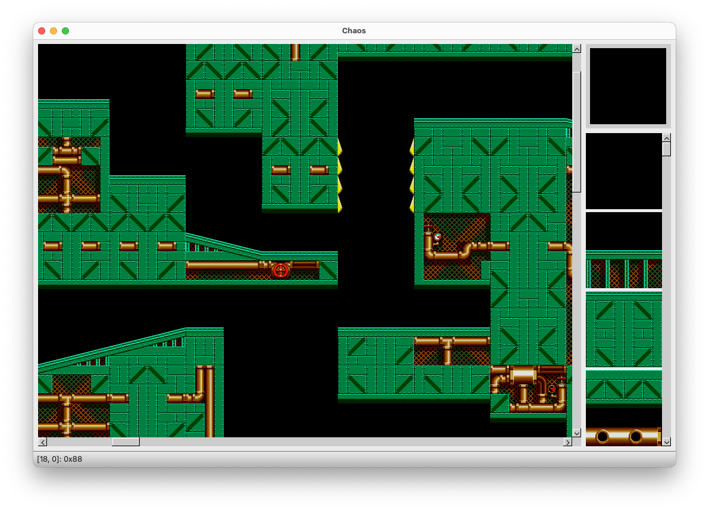
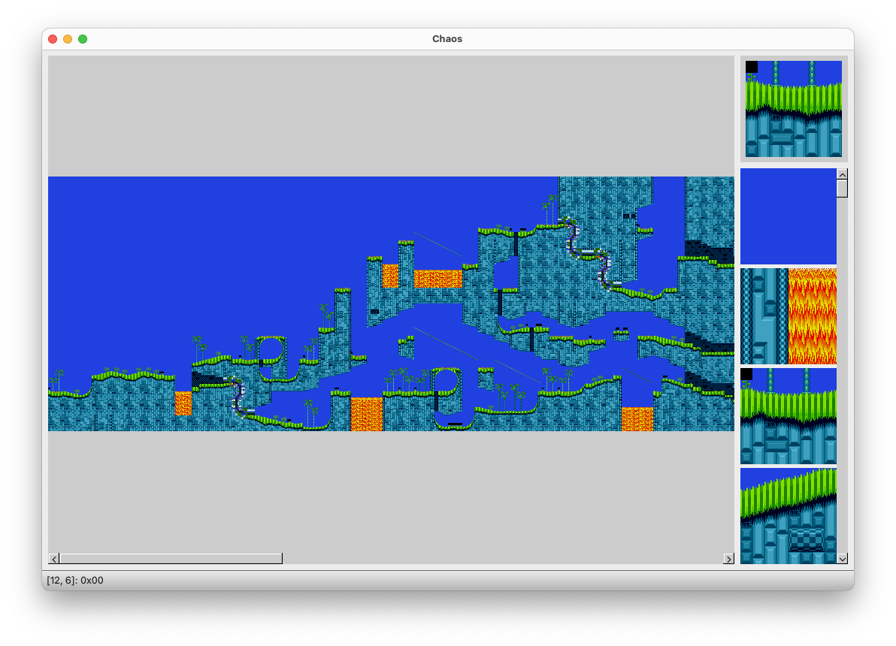

# Chaos

A level editor for Sonic The Hedgehog Mega Drive / Genesis ROMs.

This is a C++ port of Brett Kosinski's [Chaos level editor](https://github.com/fancypantalons/chaos). It can be used to modify Sonic The Hedgehog 2 ROM files. It can also be used to view levels from Sonic The Hedgehog 3 ROMs. Here's a screenshot of the app being used to edit Metropolis Zone, from Sonic The Hedgehog 2:

Levels can also be zoomed in and out while editing, as seen in this screenshot of Hill Top Zone:

Although it was tempting to choose a different name for the project, I've continued to use the name _Chaos_. This is because my port attempts to preserve the spirit of simplicity and openness of the original code.

## Background

I first discovered Brett Kosinski's Chaos level editor around 2001. Remarkably, this open source level editor made it possible to edit levels directly within a ROM file for Sonic The Hedgehog 2. Not only did Brett manage to extract the compressed level and art data from the ROM, his program also allowed new data to be saved to the ROM file, relocating level data to the end of the file and updating the necessary metadata.

As a pretty average high-schooler circa 2001, I found this sophistication mind-blowing. I spent many days (probably weeks) figuring out how it all worked, and while I didn't quite grasp it all at the time, I eventually produced my own rudimentary level editor using Visual Basic. My editor worked with save states, and a few people in the SEGA reverse engineering community seemed to appreciate it.

In the years that followed, I came back to this challenge as a way to learn new languages and to refine my skills as a programmer. First with Delphi/Pascal, and then with C++. Many years later, I even had a go [with Haskell](./haskell).

## Win32 Port

The [msvc](./msvc) directory contains my original attempt at a C++ port, using the Win32 API. The Win32 version is only capable of viewing levels, and cannot be used to actually edit levels. The main achievement in this early port was figuring out how to read data from Sonic 3 ROM files:

Although efforts have been made to tidy up this code, it should be considered obsolete.

## Qt Port

The current version is based on Qt, and is much more complete. It includes basic level editing support, although level re-location is only implemented for Sonic 2 ROMs. The [PLAN](./PLAN.md) file outlines the general direction of on-going development.

## Documentation

Included in the [doc](./doc) directory is Brett Kosinski's original [write up](./doc/kosinski.txt) of the compression algorithm used.

The [haskell](./haskell/) directory contains an attempt to implement Kosinski / RLE decompression using Haskell. This would probably be considered terrible Haskell code, as I wrote it very early on in my attempts to learn Haskell.

## Build

This version of the code can be built using Qt versions 5 and 6. Assuming you have Qt and CMake installed, the basic build steps are as follows:

    git clone https://github.com/tristanpenman/chaos.git
    cd chaos/qt
    mkdir build
    cd build
    cmake ..
    make

This will compile both the main application and a test suite.

On Mac, this will build an application bundle called `Chaos.app`. The test suite is a single binary called `ChaosTest`.

The project can also be built from within Qt Creator.

## License

This code is licensed under the MIT License.

See the LICENSE file for more information.
