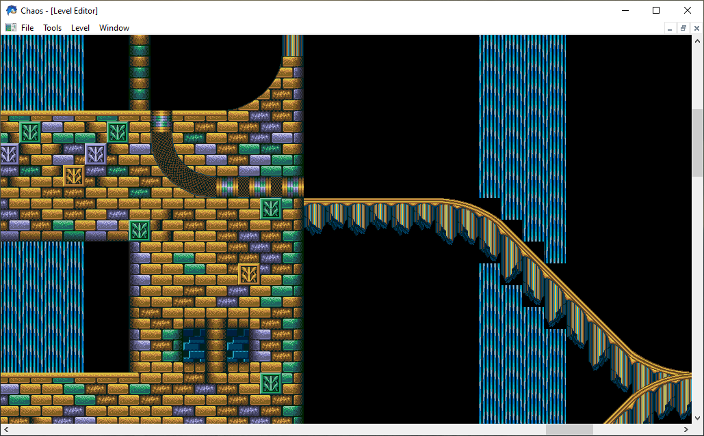

# Chaos Win32

This directory contains my original Win32 / MSVC port of Chaos.

It is only capable of viewing levels, not editing them. It's main contribution was support for reading levels from Sonic The Hedgehog 3 ROMS:

## Warning

While efforts have been made to tidy up this code, it should be considered obsolete.
