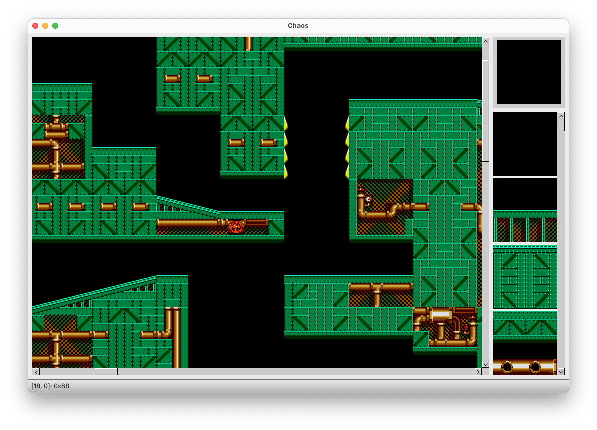

# Chaos Qt Port

This directory contains the Qt version of the Chaos level editor. It can be built using Qt versions 5 and 6.

The project can be built using CMake. Assuming you have Qt and CMake installed, the basic build steps are as follows:

    git clone https://github.com/tristanpenman/chaos.git
    cd chaos/qt
    mkdir build
    cd build
    cmake ..
    make

This will compile both the main application and a test suite.

On Mac, this will build an application bundle called `Chaos.app`. The test suite is a single binary called `ChaosTest`.

The project can also be built from within Qt Creator.

## Usage

The app offers a pretty simple user interface for modifying levels. Here's a screenshot of the app being used to edit Metropolis Zone, Act 1 from Sonic The Hedgehog 2:

Tiles can be selected from the list on the right, with the current tile shown in the top-right corner. Clicking anywhere on the map will modify that tile.

You can also zoom in and out by scrolling the mouse-wheel, while holding the meta key. On Mac, this is the `Command` key. On Windows, this is the `CTRL` key.

Here's a broader view of Hilltop Zone, Act 2 from Sonic The Hedgehog 2:

